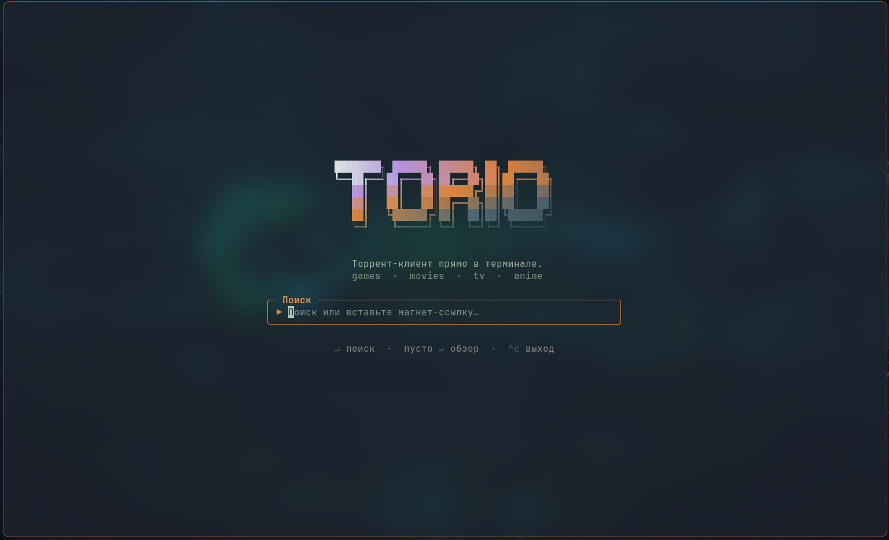
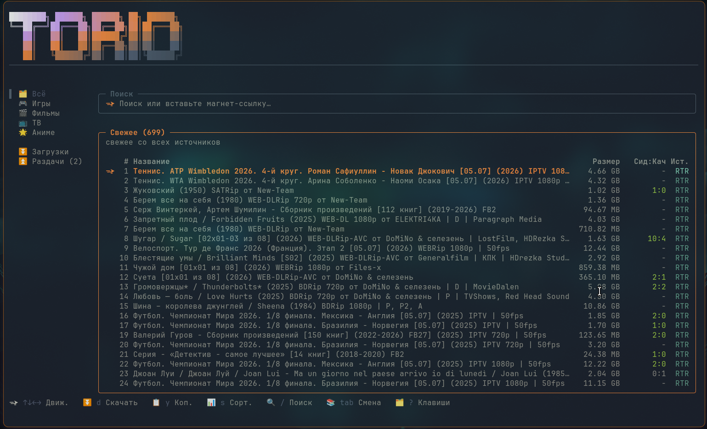
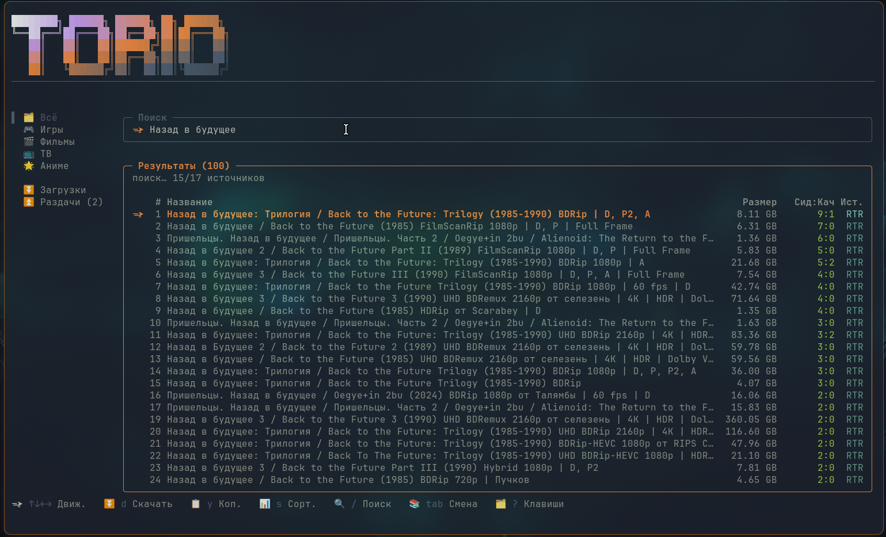
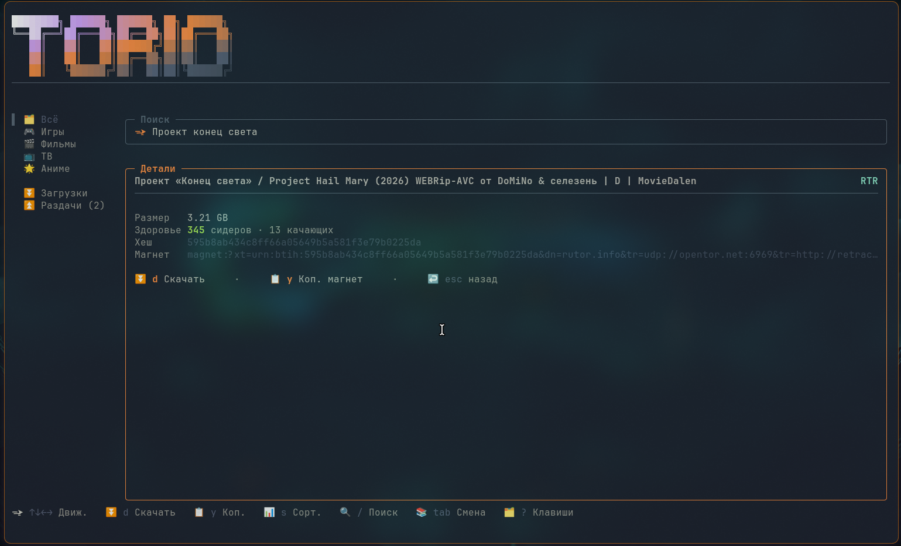
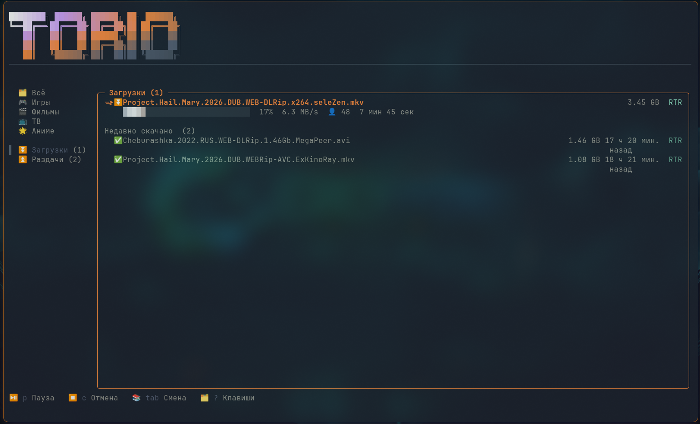
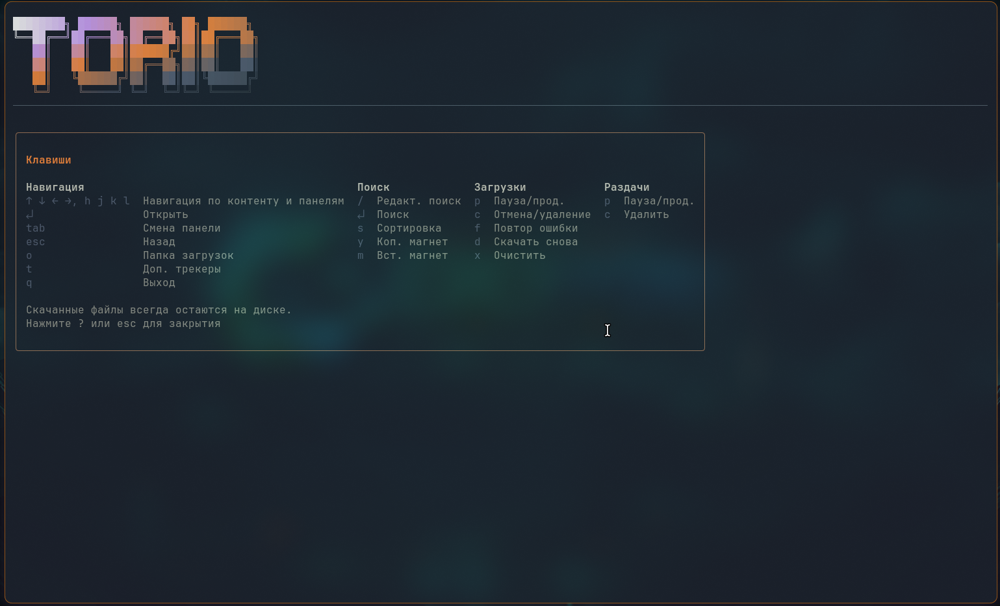

# torio

[](https://www.npmjs.com/package/torio-cli)
[](https://github.com/y-tretyakov/torio)

torio — это быстрый и бесшовный способ искать торрент-материалы прямо из терминала и сразу скачивать их без лишних шагов.

Никакой сложной настройки, никаких всплывающих окон и лишних вкладок. Введите запрос, выберите результат, и torio всё сделает за вас: проверит несколько источников, покажет размеры и сиды, а затем начнёт загрузку в нужную папку.

<p align="center">
  
</p>

<p align="center">
  
</p>

<p align="center">
  <em>«Последние поступления» — свежие релизы со всех подключённых источников, упорядоченные по времени добавления.</em>
</p>

## Почему torio

- Поиск сразу по нескольким проверенным источникам.
- Никакой ручной настройки и конфигов для старта.
- Удобный интерфейс в терминале с клавиатурной навигацией.
- Загрузка в фоне, поддержка очереди и возобновление прерванных задач.
- Автоматическое продолжение раздачи после окончания скачивания.

<p align="center">
  
</p>

## Как использовать

1. Установите Node.js с [nodejs.org](https://nodejs.org) (версия 22 или выше).
2. Откройте терминал.
3. Запустите:

   ```sh
   npx torio-cli
   ```

   Или установите глобально:

   ```sh
   npm install -g torio-cli
   torio
   ```

После запуска вы увидите строку поиска. Можно ввести название фильма, сериала, игры или просто нажать Enter, чтобы открыть подборку. Для навигации используются стрелки, клавиша `d` — для скачивания, а `?` — для справки по горячим клавишам.

### Обновление

Если у вас уже установлена старая версия, обновите её:

```sh
npm update -g torio-cli
```

Или переустановите:

```sh
npm install -g torio-cli@latest
```

<p align="center">
  
</p>

## Что происходит во время загрузки

Активные загрузки отображаются сверху с прогрессом, скоростью и оставшимся временем. Когда задача завершена, она перемещается в раздел «Недавно скачано», а все остальные продолжают находиться в очереди.

Загрузка не мешает поиску: можно продолжать искать новые торренты, пока текущие выполняются в фоне. После завершения торренты продолжают раздаваться, если вы не отключили эту функцию вручную.

<p align="center">
  
</p>

## Поддерживаемые источники

torio собирает результаты из нескольких источников, в том числе:

| Категория | Источники |
| --- | --- |
| Игры | FitGirl, NNM Club, Rutor, Torentino |
| Фильмы | YTS, The Pirate Bay, 1337x, NNM Club, Rutor |
| ТВ | EZTV, The Pirate Bay, 1337x, NNM Club, Rutor |
| Аниме | Nyaa, SubsPlease, Rutor |

Если один источник недоступен, torio просто продолжает поиск без него и сообщает об этом.

<p align="center">
  
</p>

## Разработка

Чтобы запустить torio локально:

1. Склонируйте репозиторий:

   ```sh
   git clone https://github.com/y-tretyakov/torio.git
   cd torio
   ```

2. Установите зависимости:

   ```sh
   npm install
   ```

3. Запустите dev-режим:

   ```sh
   npm run dev
   ```

4. Для сборки и запуска готовой версии:

   ```sh
   npm run build
   node dist/cli.cjs
   ```

Перед отправкой pull request обязательно прочитайте [CONTRIBUTING.md](CONTRIBUTING.md).

## Конфиденциальность и раздача

Все файлы остаются на вашем устройстве. torio не передаёт данные через центральный сервер: обмен идёт напрямую через торрент-сеть. После завершения загрузки раздача может продолжаться по умолчанию, чтобы другие пользователи также могли получить файл. Если вы не хотите поддерживать раздачу, это можно отключить в интерфейсе.

## Лицензия

Проект распространяется под лицензией MIT. Подробности — в [LICENSE](LICENSE).
